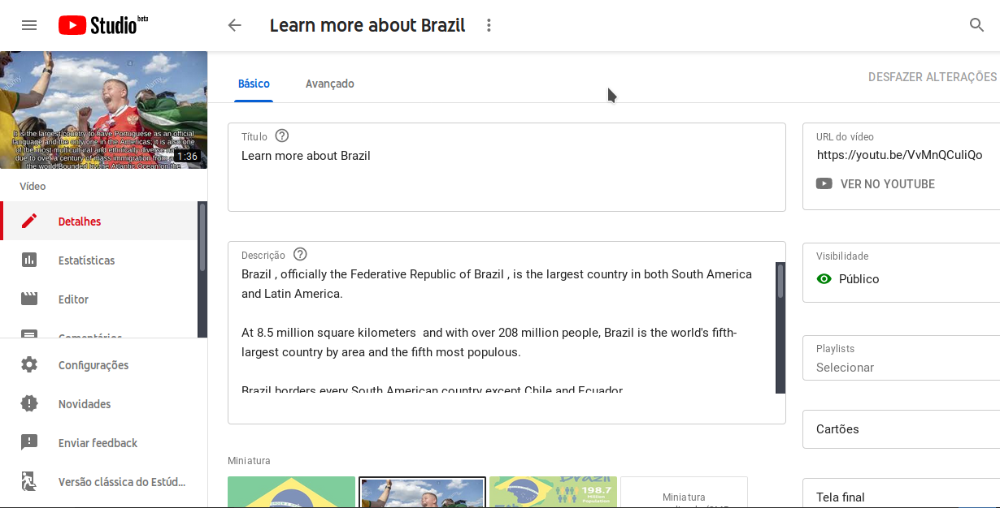
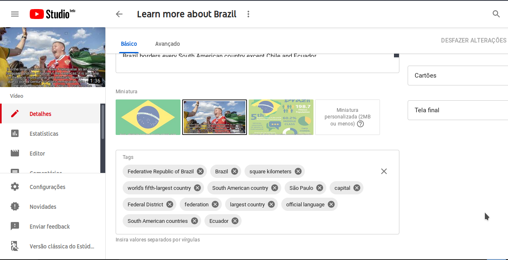

# YouTube Video Maker

A tool for automatic video creation and uploading on YouTube.


### Result:





## Getting Started

These instructions will show you how this tool works and how to have the project up and running on your local machine.

### Prerequisites

FFmpeg (version used to build this tool: 4.1.1-1)

```
$ sudo apt-get install ffmpeg   # on Debian based systems
$ sudo yum install ffmpeg       # on Red Hat based systems
```

Python libraries:

```
$ sudo pip3 install google_images_download      # 2.5.0
$ sudo pip3 install wikipedia                   # 1.4.0
$ sudo pip3 install nltk                        # 3.4
$ sudo pip3 install watson_developer_cloud      # 2.8.0
$ sudo pip3 install google-api-python-client    # 1.7.8
$ sudo pip3 install oauth2client                # 4.1.3
```

You will need to use the NLTK Downloader to obtain punkt:

```
$ python3
>>> import nltk
>>> nltk.download("punkt")
>>> exit()
```

### Download this repository:

```
$ git clone https://github.com/crhenr/youtube-video-maker.git
```

### Add your API keys

You will need to put your Watson API keys in the ``` searchrobot.py  ``` file:
```
...
iam_apikey = "YOUR_API_KEY_HERE",
url = "YOUR_URL_HERE"
...
```

And your Google API keys in the ``` clients_secret.json ``` file:
```
...
"client_id": "YOUR_CLIENT_ID_HERE",
"client_secret": "YOUR_CLIENT_SECRET_HERE",
...
```

### Run the main file

After completing all the settings, just run the main file:
```
$ cd youtube-video-maker/src
$ python3 yvm.py
```

# How it works?

The program behaves as follows:
 * 1. Get the Wikipedia search term and the prefix;
 * 2. Get the first sentences from the Wikipedia summary which corresponds to the search term;
 * 3. Remove unnecessary information;
 * 4. Send each sentence to Watson to get the corresponding keywords;
 * 5. Download some images from Google Images based on the keywords;
 * 6. Rename and convert the images to JPG;
 * 7. Make the video, add the sentences as subtitles and add a music;
 * 8. Send the final video to YouTube with title, description and tags.

NOTE: All the files (images, videos and subtitles) are saved in the user's folder, in a directory with the search term name.

Example: [final_video.mp4](examples/final_video.mp4)

# Bugs to fix:
 * Get better images;
 * Gorrect the error that causes the fifth subtitle to be skipped.

### Other information

Project inspired by [video-maker](https://github.com/filipedeschamps/video-maker), by [filipedeschamps](https://github.com/filipedeschamps)

Music extracted from: [https://www.youtube.com/watch?v=LeV4u5Y-3ac](https://www.youtube.com/watch?v=LeV4u5Y-3ac)

Original video upload code: [https://developers.google.com/youtube/v3/guides/uploading_a_video?hl=en](https://developers.google.com/youtube/v3/guides/uploading_a_video?hl=en)
